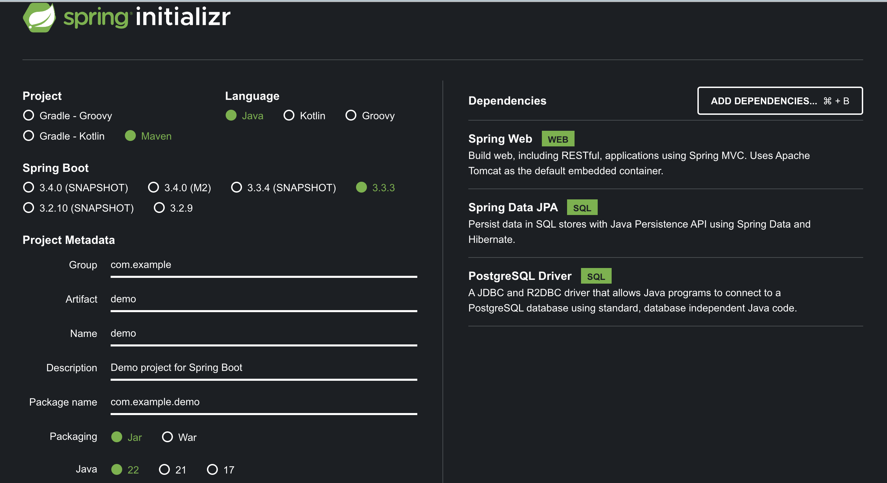

## java-spring-boot

- easy to learn
- Configuration
- security
- logging
- Connecting to db
- Metrics
- Production ready
- microservices
- dependency injection
- Great Community
- and more

### spring initializer

[start.spring](https://start.spring.io/), Maven, Java

