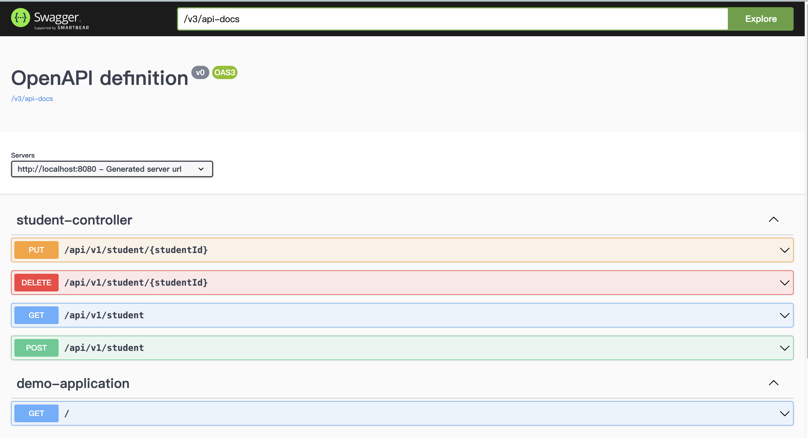

## Java Spring Boot: java-spring-boot, production-ready. Maven.

- easy to learn
- Configuration
- security
- logging
- Connecting to db
- Metrics
- Production ready
- microservices
- dependency injection
- Great Community
- and more


### spring initializer
[start.spring](https://start.spring.io/), Maven, Java


### Using VSCode Shortcuts
Use the shortcut Ctrl + . (Windows/Linux) or Cmd + . (Mac) to bring up the Quick Fix menu.


### Spring Boot
Spring Boot is an extension of the Spring Framework that simplifies the process of creating stand-alone, production-ready Spring applications.

Key Features:
- Auto-configuration: Automatically configures your Spring application based on the dependencies you have added.
- Embedded Servers: Comes with embedded servers like Tomcat, Jetty, or Undertow, eliminating the need to deploy WAR files.
- Starter Dependencies: Pre-configured dependency descriptors to simplify build configuration, e.g., spring-boot-starter-web.
- Production-ready: Includes features like metrics, health checks, and externalized configuration, making it easier to move to production.

Basic Project Structure:
- src/main/java: Contains your main application code.
- src/main/resources: Contains configuration files like application.properties.
- ```pom.xml``` or ```build.gradle```: Project’s build configuration and dependencies.

Core Concepts and Annotations:
- @SpringBootApplication: A convenience annotation that includes @Configuration, @EnableAutoConfiguration, and @ComponentScan.
- @RestController: Combines @Controller and @ResponseBody, used for creating RESTful web services.
- @RequestMapping: Maps HTTP requests to handler methods of MVC and REST controllers.
- @Autowired: Automatically injects dependencies, similar to dependency injection in other frameworks like Node.js.


When is the target Folder Generated?
- The target folder is created when you run build commands such as mvn package, mvn install (for Maven), or gradle build (for Gradle). Each time you build the project, the existing target folder may be cleaned and recreated with fresh contents.

### RESTful API
Creating a RESTful API (API Layer), and Business Layer (Service Layer)

0. Print information:

```java
System.out.println(student);
```

1. Define a Controller:
File path ```src/main/java/com/example/demo/DemoApplication.java```

```java
@SpringBootApplication
@RestController
public class DemoApplication {
	public static void main(String[] args) {
		SpringApplication.run(DemoApplication.class, args);
	}

	@GetMapping
	public String hello() {
		return "Hello World";
	}
}

```

2. Run the Application:
In your main class with the @SpringBootApplication annotation, right-click and select “Run” or execute mvn spring-boot:run in the terminal.
Visit http://localhost:8080 to see your first Spring Boot endpoint in action.

#### Dependency Injection:
The StudentService is injected into the StudentController through the constructor. Spring automatically provides the StudentService when the controller is created.

Define a Controller and Service. Routing visit ```src/main/java/com/example/demo/student```.

### Using Database (PostgreSQL)
Use This docker-compose.yml File, Run the Docker Compose Command:

```bash
docker-compose up -d

# Access the PostgreSQL Container (if using Docker)
docker exec -it student-db /bin/bash

# Enter the psql Shell
psql -U student -d student
# List All Roles
student=# \du

```

Common psql Commands for Database Interaction
- \l: List all databases.
- \c database_name: Connect to a specific database.
- \dt: List all tables in the current database.
- \du: List all the roles (users) in current database along with their attributes.
- \d table_name: Describe the structure of a specific table.
- SELECT * FROM table_name;: Query data from a table.
- \q: Quit the psql shell.

Database config ```src/main/resources/application.properties```

XML Dependency, ```pom.xml```

```xml
<dependency>
  <groupId>org.springframework.boot</groupId>
  <artifactId>spring-boot-starter-data-jpa</artifactId>
</dependency>
```

Create table into database, ```src/main/java/com/example/demo/student/Student.java```

```java
@Entity
@Table
public class Student {
  @Id
  @SequenceGenerator(
    name = "student_sequence",
    sequenceName = "student_sequence",
    allocationSize = 1
  )
  @GeneratedValue(strategy = GenerationType.SEQUENCE, generator = "student_sequence")
  ...
  ...
}
```
#### Data Access Layer (Repository)
Database Configuration, ```src/main/java/com/example/demo/student/StudentConfig.java```

StudentRepository, ```src/main/java/com/example/demo/student/StudentRepository.java```
```java
@Repository
public interface StudentRepository extends JpaRepository<Student, Long> {
  // You can define custom query methods here if needed
}
```

Update StudentService, ```src/main/java/com/example/demo/student/StudentService.java```
```java
@Service
public class StudentService {

  private final StudentRepository studentRepository;

  @Autowired
  public StudentService(StudentRepository studentRepository) {
    this.studentRepository = studentRepository;
  }

  public List<Student> getStudents() {
    return studentRepository.findAll();
  }
}
```

### Package up application into Jar
Run Maven Commands:

``` bash
# To run the Maven clean command (which deletes the target directory), type:
mvn clean
# To run the Maven install command (which compiles your code, runs tests, and packages it), 
mvn install
# To combine both commands, you can run:
mvn clean install

# This command will compile the code, run tests, and package the application into the target folder
mvn clean package
```

After running install, you can find ```target/demo-0.0.1-SNAPSHOT.jar```

```bash
# check java version
java -version

# openjdk version "22.0.2" 2024-07-16
# OpenJDK Runtime Environment Homebrew (build 22.0.2)
# OpenJDK 64-Bit Server VM Homebrew (build 22.0.2, mixed mode, sharing)

# run jar
java -jar target/demo-0.0.1-SNAPSHOT.jar

# run jar different port
java -jar target/demo-0.0.1-SNAPSHOT.jar --server.port=9090
```

### Deployment

#### Create a Dockerfile and Run with Docker Compose

```bash
# Step 1: Package the application with Maven
mvn clean package

# Step 2: Build the Docker image
docker build -t my-spring-boot-app .

# Step 3: Run the Application with Docker Compose
docker-compose -f docker-compose-service.yml up --build
```

### Spring Cloud Config
Spring ecosystem that provides server-side and client-side support for externalized configuration in a distributed system. It allows you to manage configuration properties across multiple environments (development, testing, production) and applications in a centralized way, improving the consistency and maintainability of configuration management.

Key Features of Spring Cloud Config:
- Centralized Configuration Management: Store configuration files in a centralized location, typically a Git repository, making it easy to manage and version configurations.
- Dynamic Updates: Configuration changes can be dynamically updated in running services without restarting them, allowing you to adjust settings on the fly.
- Environment Profiles: Support for multiple environments and profiles, such as dev, test, and prod, with configuration overrides.
- Secure Configuration: Support for encrypting sensitive information, like passwords and API keys.


### Swagger
Swagger: API Documentation & Design Tools for Teams

1. Add Dependencies to pom.xml

```xml
<dependencies>
    <!-- Other dependencies -->

    <!-- Springdoc OpenAPI for Swagger Integration -->
    <dependency>
        <groupId>org.springdoc</groupId>
        <artifactId>springdoc-openapi-starter-webmvc-ui</artifactId>
        <version>2.1.0</version>
    </dependency>
</dependencies>
```

2. Rebuild and Restart Your Application
```
mvn clean install
mvn spring-boot:run
```

3. Access via the default path ```http://localhost:8080/swagger-ui/index.html```



4. Configure Spring Boot Application Properties (Optional):

```
springdoc.api-docs.path=/v3/api-docs
springdoc.swagger-ui.path=/swagger-ui.html
```

If customized with application.properties as shown above, try ```http://localhost:8080/swagger-ui.html```

### Security
1. Dependency Management and Vulnerabilities
- Use tools like OWASP Dependency-Check or Snyk to scan dependencies for known vulnerabilities. Regularly update your dependencies to the latest secure versions.
- Maven Repositories and Source Authenticity. Only use trusted repositories (e.g., Maven Central) and validate the sources of external dependencies. Avoid adding untrusted repositories without verifying their credibility.
- Checksum Validation

2. Secure Your settings.xml
Credentials Management: Maven's settings.xml file often stores credentials for private repositories or deployment servers.
- Do not hard-code sensitive credentials directly in settings.xml. Instead, use environment variables, encrypted credentials, or secure credential storage.
- Use Maven’s built-in encryption feature for passwords (mvn --encrypt-password).

### Spring Data JPA

### Testing

### Performance - Using Redis

### Monitoring